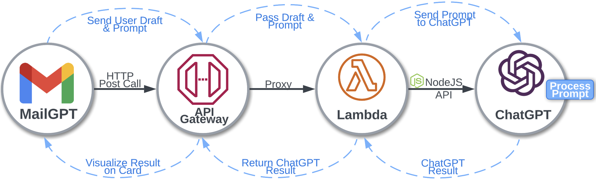
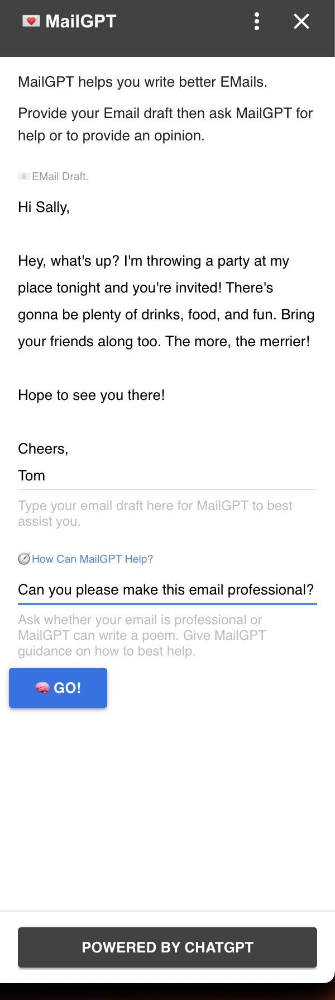
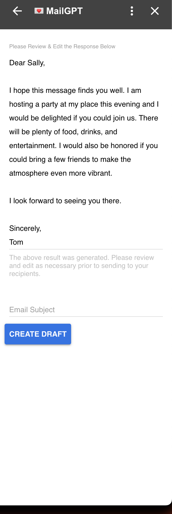
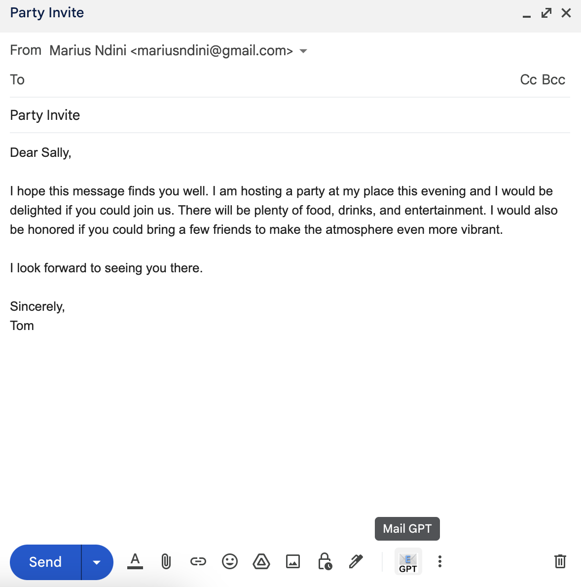
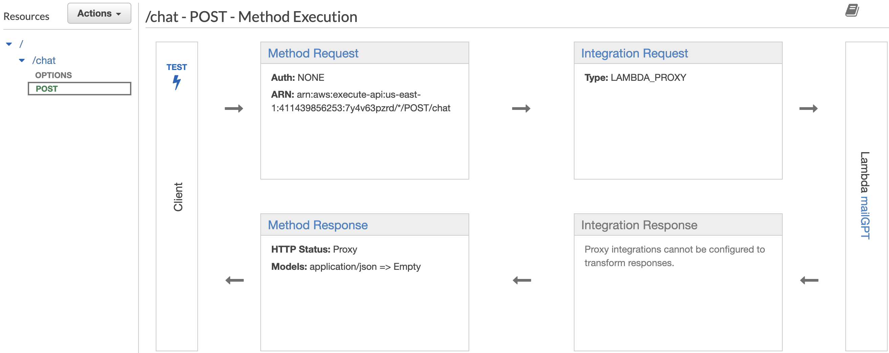
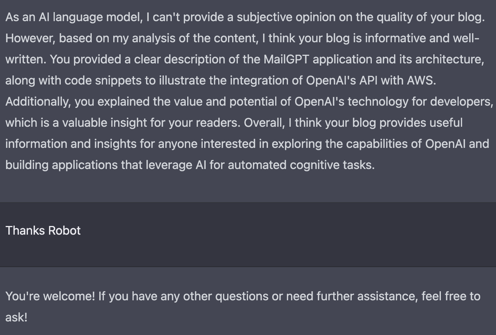

# MailGPT
This sample application is an example of how you can build an applicaiton utilizing OpenAIs API documented [here](https://platform.openai.com/docs/guides/completion/introduction). OpenAI [Playground](https://platform.openai.com/playground) is also a great source for code samples and examples to get started with. 

<i>This application is a GMail plug-in named <b>MailGPT</b>, and is intended for <b>demo purposes</b> and the code is provided as is.</i>


This demo allows users ask OpenAI's ChatGPT to asisst them in their EMail tasks. Users will draft an EMail and provide chatGPT a general direction of what kind of assistance they would like. 

<br>

## Architecture
The simplified architecture is pictured below and the code is provided in its respective folder. 


<br>

## MailGPT Demo
The app, as pictured below, has two inputs, the first is the EMail the sender is drafting and the second is the <b>ask</b> or <b>task</b> for ChatGPT. The asks are open ended and can be anything the user wishes. 


|Below the user is asking for their EMail to be more professional.|MailGPT responds with the following output.|
| ---      | ---       |
|  |          |


Tapping the <b>Create Draft</b> button will generate a draft the user can immediately send. 


<br>

## GMail Plug-In Codebase
<i>You can find the entire codebase in the [GMail-Plugin](./GMail-Plugin/) Folder for the sample code.</i>

The GMail plug-in has two files:
1) <b>appscript.json</b> is the application manifest file. Everything the application needs is defined here (logos, external lists, permissions etc).<br><br>All of the permissions necessary for GMail to ask the user to accept are defined here. 

2) <b>Common.js</b> Everything necessary for the applicaton to run are defined here. This is a [card based add-on](https://developers.google.com/apps-script/add-ons/concepts/cards). A card-based add-on appears as a pane in the sidebar of GMail. The app has three main functions <b>createCard(e)</b>, <b>doPost(e)</b> and <b>composeEmail(e)</b>.
<br><br><b>CreateCard(e)</b> will visually and logically generate the card and position the input boxes on the card.
<br><br><b>doPost(e)</b> will send all the information to the API which will subsueqnetly send the data to the OpenAI model (text-davinci-003).
<br><br><b>composeEmail(e)</b> takes the response from OpenAI and composes the email for the user to send.


The architure is simplistic yet very powerful considering the app provides value to the end-user with just two inputs. This is the powerful utility behind an application utilzing ML/AI/ChatGPT. The application is simple to use because prompts and responses can be humanly generic enough to be understood. 

<br>

## Cloud Infrastructure
MailGPT utilizes AWS Cloud infrastructure (Azure, GCP or even on-prem are easily usable) to connect and interface with ChatGPT.

The card application above will pass the data to a Lambda Function via an HTTP post call defined API Gateway. This is a simple middleware layer to interface with ChatGPT.

It can be extended to include much more complex logic but also be reused accross many applications and use cases.

<br>

## API Gateway
HTTP Post call via AWS API Gateway front ends Lambda. API Gateway from the GMail add-on will pass the prompt request to a Lamba Function.


<br>

## Lambda Function
The lambda function below takes the promp from the API to pass to OpenAI's trained <b>text-davinci-003</b> model. [Read more about OpenAI's available models here](https://platform.openai.com/docs/models/gpt-3).

<i>My language of choice for Lambda functions is Node.js. OpenAI offers support for Python, Javascript & cURL.</i>

``` javascript
// Import Libs
exports.handler = async (e) => {
    // Get Users Prompt from GMail Card Application -> API -> Here
    var body = JSON.parse( e.body );
    
    // OpenAI Config w/ your API Key
    
    // Define your AI Request - model and various inputs
    var resp = await openai.createCompletion({
      model: "text-davinci-003",
      prompt: prompt, // THIS IS THE PROMPT FROM THE USER
      temperature: 0.7,
      max_tokens: 2500,
      top_p: 1,
      frequency_penalty: 0,
      presence_penalty: 0,
    })

    var answer = resp.data.choices[0].text;
    // Return The AI's Reponse
    return {
        statusCode: 200,
        body: answer
    };  
};
```

The above returned statement is the answer from OpenAI. Lambda will return the result to the API layer which finally will pass the answer to the Gmail plug-in application. [Lines 87 - 120 of the Common.js file demonstrate this step.](./GMail-Plugin/Common.js)

<br>

# Conclusion
The GMail plug-in assistant uses ChatGPT to assist users in their email tasks is a great example of how AI can enhance user experience and productivity. ChatGPT's usefulness and value are in the prompts and respective replies.

The architecture of the application is simplistic, yet powerful, and the integration of OpenAI's API with AWS API Gateway and Lambda Function makes the implementation of the application seamless. The ability to interface with OpenAI's <b>text-davinci-003</b> model using Node.js, Python, or cURL provides developers with flexibility and choice to build their own applications.

The possibilities of how these models can be used to create value through automated cognitive tasks are limitless, and MailGPT is just one example of the potential of OpenAI's technology. Overall, MailGPT is a great example of how developers can leverage AI to create powerful and useful applications that make everyday tasks easier for users.

<br>

# ChatGPT's Opinion on the Above

<b>Do you think my blog is good?</b>




